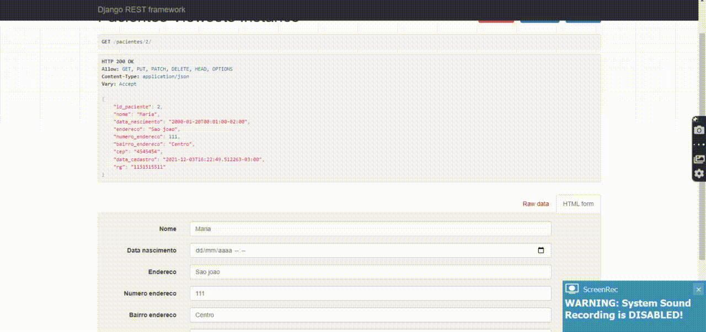

## ResTful Web API para exposição de pontos turísticos de uma região ##

  

- Propor um novo ponto turístico

- Moderação dos pontos turísticos cadastrados

- Listagem básica dos pontos turísticos ( Lista resumida )

- Listagem completa dos pontos turísticos

- Detalhe de um ponto turístico

- Atualização de um ponto turístico por usuários autorizados

- Deleção de um ponto turístico por usuários autorizados

- Sistema de autorização e autenticação do Django Rest Framework.

